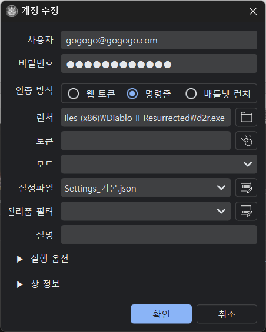
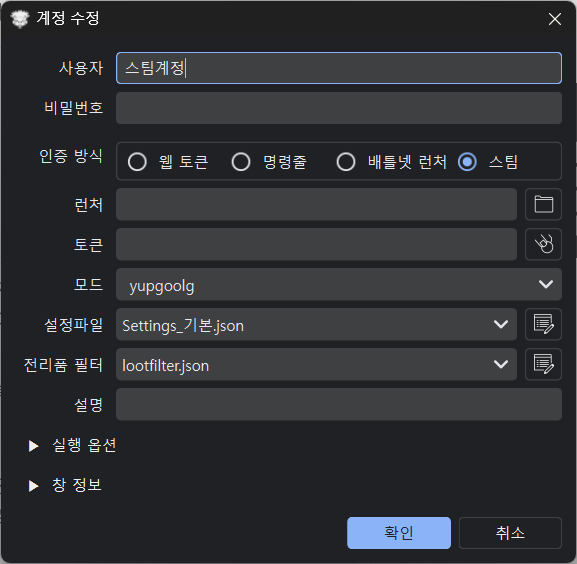

# 계정 관리

## 계정 등록

계정 생성이나 사이드 패널에서 계정 정보를 입력하고 등록합니다.



### 필수 입력 항목

|항목|설명|
|------|------|
|사용자|배틀넷 계정으로 이메일 주소 형식입니다.|
|비밀번호|배틀넷 계정에 대한 비밀번호입니다.<BR>잘못 입력하면 계정잠김이나 CAPCHA가 활성화되므로 정확하게 입력하세요.|
|런처|d2r.exe 또는 Launcher.exe 경로입니다.|

### 선택 입력 항목

| 항목 | 설명 |
|------|------|
| 모드 | 사용할 모드(mod) 이름입니다.|
| 설정파일 | 클라이언트별 설정파일(Settings.json)입니다. 계정별로 다르게 지정할 설정할 수 있습니다.<BR> **Settings**로 시작 **.json** 으로 끝나도록 저장해서 사용합니다.<BR>예) **Settings_메인.json**, **Settings_서브.json**|
| 설명 | 창 제목에 표시할 텍스트 |

### 버튼

- **확인**: 새 계정 추가 또는 선택된 계정 정보 수정합니다. <BR>**최종 반영을 위해서는 파일 → 저장이 필요합니다.**
- **취소**: 계정 생성 및 수정 창을 닫습니다.

## 인증 방식

### 명령줄 방식

가장 기본적인 인증 방식입니다.

```
    d2r.exe -username abc@abc.net -password mypassword
```

!!! warning "제한사항"
    - ~~아시아(한국) 서버는 2023년 10월부터 **차단**됨~~ 다시 복구되었습니다.
    - OTP(인증기) 사용 계정은 **사용불가**입니다.

### 웹 토큰 방식

토큰을 발급받아 인증하는 방식입니다.

!!! success "장점"
    - 아시아 서버 접속 가능합니다.
    - OTP 사용 계정 지원합니다.
    - 한 번 발급 후 다시 발급할 때 까지 계속 사용 가능합니다.

### 배틀넷 런처 방식

배틀넷 런처를 스크립트로 제어하여 실행합니다.

!!! note "참고"
    웹 토큰 방식 구현 전 임시로 사용하던 방식입니다.
    동기화 문제가 발생할 수 있으므로 가능하면 다른 방식을 사용하세요.

### 스팀 방식

스팀 계정으로 실행합니다. 실행 후 스팀 계정 로그인을 수행합니다. 



## 토큰 발급

웹 토큰 방식 사용 시 토큰을 발급받아야 합니다.

### 자동 발급 (권장)

1. 사용자, 비밀번호 입력합니다.
2. 토큰 입력창 옆 **아이콘 클릭**합니다.
3. 프로그램이 자동으로 토큰 발급합니다.
4. OTP 사용 시 30초 이내 인증이 필요합니다. (인증기를 미리 준비해두세요.)

!!! tip "OTP 인증 시간"
    **환경설정 → 고급 설정 → 토큰 생성 → OTP 대기 시간**에서 조정 가능 (10~120초, 기본값: 30초)

### 수동 발급

1. 크롬이나 엣지 브라우저에서 **새 시크릿 창** 엽니다.<BR>
   (멀티로더에 `토큰`글자를 클릭하면 엣지 브라우저가 시크릿 모드로 열립니다.)
2. 다음 주소 접속:
```
   https://us.battle.net/login/en/?externalChallenge=login&app=OSI
```
3. 로그인 후 에러 페이지에서 토큰 복사합니다. (루프백 주소라 에러가 나는게 정상입니다.)
4. 주소창에서 `ST=` 뒤의 값 복사합니다.
```
   http://localhost:0/?ST=US-xxxxx-xxxxxxxx&flowTrackingId=...
```
5. 프로그램의 토큰 입력창에 붙여넣기를 합니다.

!!! note "서버 지역 코드"
    토큰 앞의 US, KR, EU 등은 실제 접속 서버에 영향을 주지 않습니다.

### 토큰 저장

자동, 수동 발급 모두 토큰 발급 후 반드시:

1. **확인** 버튼 클릭한 후에
2. **파일 → 저장**으로 계정 정보를 저장하세요.

!!! Waring "특수문자 주의사항"
    사용자 아이디나 비밀번호에 다음 문자가 포함되면 명령줄 실행이 안 될 수 있습니다.<BR>
    예) 콤마 (`,`), 세미콜론 (`;`), 등호 (`=`), 공백문자 (스페이스, 탭 등)<BR>
    이런 경우 **웹 토큰 방식**을 사용하세요.


## 클라이언트별 설정파일

각 클라이언트마다 다른 비디오/오디오 설정을 사용할 수 있습니다.

### 설정파일 위치

```
%userprofile%\Saved Games\Diablo II Resurrected\
├── Settings.json      # 기본 설정
├── Settings_1.json    # 클라이언트 1용
├── Settings_2.json    # 클라이언트 2용
└── ...
```

### 적용 방법

1. `Settings.json` 복사
2. 원하는 이름으로 저장 (예: `Settings_Low.json`)
3. 파일 내용 수정 (해상도, 음량 등)
4. 계정 설정에서 **설정파일** 선택

!!! note "동작 원리"
    실행 시 지정된 설정파일을 `Settings.json`으로 복사하고, 종료 후 원래 파일로 복구합니다.
    
    클라이언트 설정들은 Settings.json 파일에 저장됩니다.<BR>
    여러 게임 클라이언트가 하나의 Settings.json 파일을 공유하며 마지막으로 종료한 게임의 설정을 Settings.json에 덮어 쓰게 됩니다.<BR>
    특정 계정의 게임에 설정을 유지하고 싶으시면<BR>
    ① 배틀넷 런처로 단독 실행하신 후에 원하는 설정을 모두 하시고 종료하세요.<BR>
    ② %userprofile%\Saved Games\Diablo II Resurrected\Settings.json 파일을 복사해서 Settings_계정명.json 으로 만드세요.<BR>
    ③ 멀티로더에서 해당 계정에 좀 전에 복사한 파일, Settings_계정명.json을 선택한 후에 저장하세요.<BR>

### 설정파일 편집

계정 설정의 설정파일 옆 **편집 아이콘**을 클릭하면 JSON 편집기가 열립니다.


## 계정 정보 파일

### 저장 위치

- 기본: 실행 파일과 같은 폴더의 `default.dat`에 저장됩니다.
- 다른 파일로 사용자 지정해서 저장 가능합니다.

### 암호화

- 계정 정보는 AES256 암호화 알고리즘으로 암호화되어 저장됩니다.
- 암호화 키가 다르면 파일을 읽을 수 없습니다.

!!! tip "평문으로 저장"
    다른 이름으로 저장 시에 파일 확장명을 .json 으로 저장하면 평문으로 저장해서 내용을 볼 수 있습니다.<BR>
    예) **test.json** <BR>
    평문으로 저장된 계정 정보 파일은 멀티로더에서 다시 읽을 수 는 없습니다.
    


### 백업

중요한 계정 정보이므로 `default.dat` 파일을 정기적으로 백업하세요.
