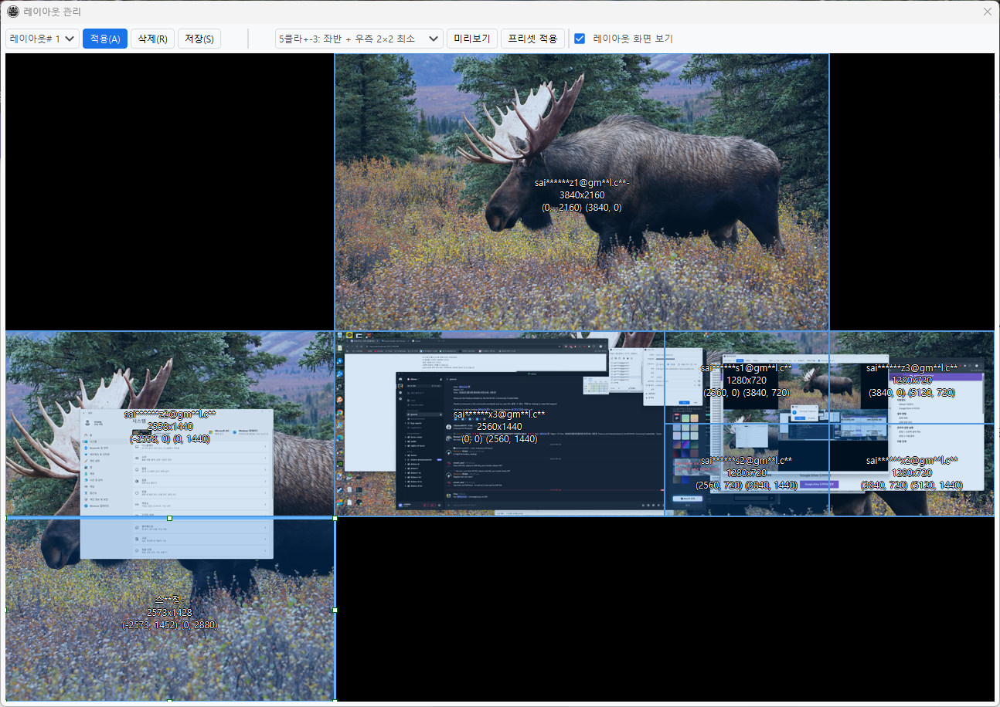

# 레이아웃 관리

여러 클라이언트 창의 위치와 크기를 저장하고 불러올 수 있습니다.

## 레이아웃 관리자 열기

**도구 → 레이아웃 관리자**

## 기본 기능

### 레이아웃 저장

1. 레이아웃 관리자에서 레이아웃 번호 선택
2. 화면 미리보기에서 창 위치/크기를 드래그로 조정
3. **저장** 버튼 클릭 → 확인 다이얼로그에서 **Yes** 선택

### 레이아웃 적용

1. 적용할 레이아웃 번호 선택
2. **적용** 버튼 클릭
3. 모든 클라이언트 창이 저장된 위치로 이동

!!! tip "레이아웃 단축키"
    - ctrl+1 ~ ctrl+8까지 레이아웃 단축키가 설정되어있습니다.
    - 차례로 레이아웃 1 ~ 8까지 대응합니다.
    - **환경설정 변경 → 단축키 관리**에서 단축키를 변경할 수 있습니다.

### 레이아웃 삭제

1. 삭제할 레이아웃 번호 선택
2. **삭제** 버튼 클릭 → 확인 다이얼로그에서 **Yes** 선택

## 인터랙티브 편집

**화면 미리보기 표시** 체크박스를 활성화하면, 실제 화면 캡처 위에 각 클라이언트 창이 사각형으로 표시됩니다. 이 사각형을 직접 드래그하여 레이아웃을 편집할 수 있습니다.

### 드래그로 이동/크기 조절

- **이동**: 사각형 내부를 드래그하면 창 위치를 이동합니다.
- **크기 조절**: 사각형의 모서리 또는 변을 드래그하면 창 크기를 조절합니다. 8방향 리사이즈 핸들이 표시됩니다.
- **스냅**: 이동/크기 조절 시 다른 창의 경계와 화면 경계에 자동으로 정렬(스냅)됩니다.

### 에지 스냅 (모니터 경계 배치)

Windows의 창 끌어서 정렬 기능과 유사하게 동작합니다:

- **왼쪽 경계로 드래그**: 해당 모니터 왼쪽 절반에 꽉 차게 배치
- **오른쪽 경계로 드래그**: 해당 모니터 오른쪽 절반에 꽉 차게 배치
- **상단 경계로 드래그**: 해당 모니터 전체에 꽉 차게 배치

드래그 중 경계에 가까워지면 파란색 미리보기 오버레이가 표시됩니다. 멀티 모니터 환경에서는 각 모니터의 경계를 개별적으로 인식하여 동작합니다.

### Ctrl+클릭으로 위치 교환

두 창의 위치를 빠르게 교환할 수 있습니다:

1. 첫 번째 창을 클릭하여 선택 (녹색 테두리로 표시)
2. **Ctrl** 키를 누른 상태에서 두 번째 창을 클릭
3. 두 창의 위치가 즉시 교환됩니다.

### 우클릭으로 수동 좌표 입력

사각형을 우클릭하면 X, Y, W, H 값을 직접 숫자로 입력할 수 있는 편집 다이얼로그가 나타납니다.

### 창 상태 표시

- **녹색 사각형 (활성)**: 현재 실행 중인 클라이언트
- **파란색 사각형 (비활성)**: 저장된 레이아웃은 있지만 현재 실행되지 않는 클라이언트
- 각 사각형에는 계정명, 해상도(WxH), 좌표가 표시됩니다.

## 프리셋 레이아웃

자주 사용하는 배치 패턴을 빠르게 적용할 수 있습니다.

### 격자 배치

- **격자 (2열 2행)**: 4분할 배치
- **격자 (3열 2행)**: 6분할 배치
- **격자 (3열 3행)**: 9분할 배치
- **격자 (자동)**: 클라이언트 수에 따라 자동으로 열 수 결정

### 계단식 배치

창을 겹치게 계단식으로 배치합니다.

### 메인+서브 배치

메인 캐릭터 1개와 나머지 서브 캐릭터를 조합하는 배치입니다:

- **전체 + 최소**: 메인 창을 전체 화면으로, 서브 창은 우측 하단에 최소 크기로 배치
- **좌반 + 꽉차게**: 메인 창을 좌측 절반에, 서브 창을 우측에 꽉 차게 배치
- 2클라, 3클라, 4클라, 5클라+ 등 클라이언트 수에 맞는 프리셋이 제공됩니다.

### 프리셋 사용 방법

1. 프리셋 콤보박스에서 원하는 배치 선택
2. **미리보기** 버튼: 화면에 미리보기만 표시 (실제 창은 이동하지 않음)
3. **프리셋 적용** 버튼: 실제 클라이언트 창에 즉시 적용

## 레이아웃 개수 설정

기본적으로 8개의 레이아웃 슬롯이 제공됩니다.

**환경설정 변경 → 고급 설정 → 윈도우 레이아웃 → 레이아웃 개수**에서 변경할 수 있습니다. (1~20)

## 활용 예시

### 모니터별 레이아웃

- 레이아웃 1: 메인 모니터용 (4개 클라이언트)
- 레이아웃 2: 듀얼 모니터용 (6개 클라이언트)
- 레이아웃 3: 울트라와이드용

### 용도별 레이아웃

- 레이아웃 1: 카오스 런 (4인 파티)
- 레이아웃 2: 우버 트리스트람 (8인 파티)
- 레이아웃 3: 테러존 사냥

## 팁

!!! tip "효율적인 레이아웃"
    - 메인 캐릭터 창은 크게, 부 캐릭터는 작게 만듭니다.
    - 자주 조작하는 캐릭터는 접근하기 쉬운 위치에 둡니다.
    - 클라이언트별 설정파일로 해상도도 다르게 설정 가능합니다.
    - Ctrl+클릭으로 두 창의 위치를 빠르게 교환할 수 있습니다.
    - 에지 스냅을 활용하면 창을 화면 절반 또는 전체에 빠르게 배치할 수 있습니다.
