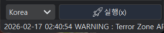
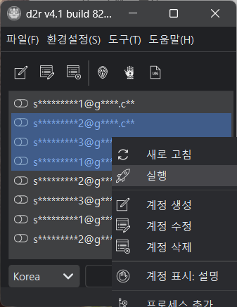
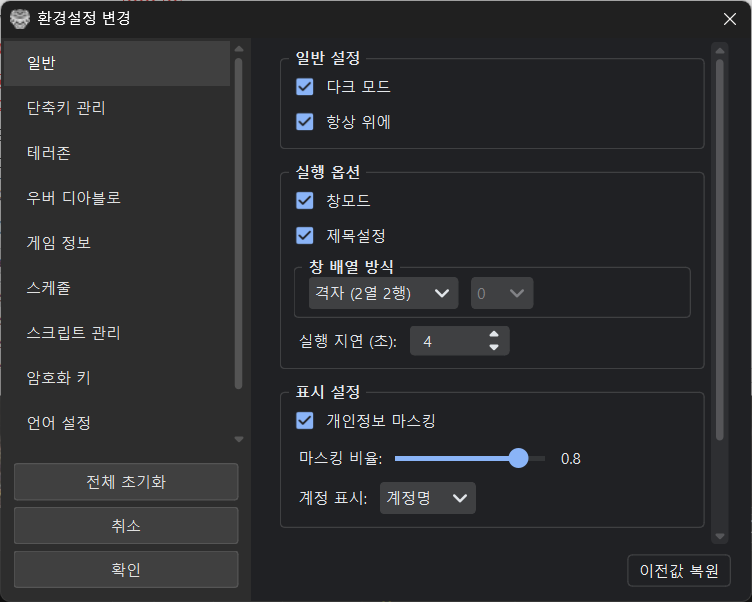
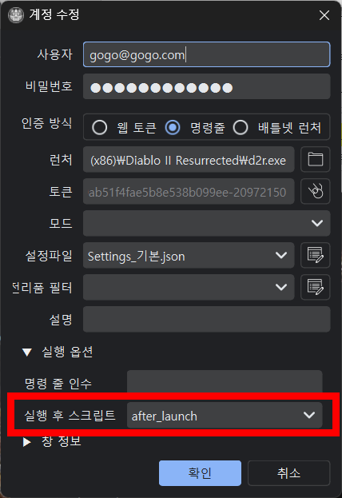
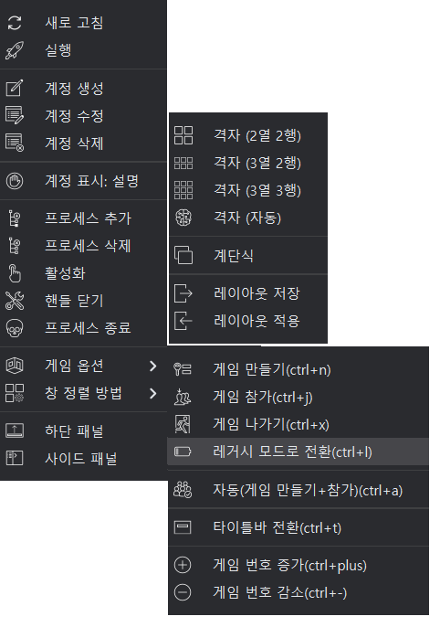
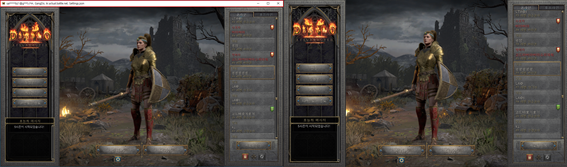
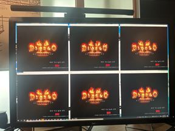

# 멀티 런처

## 원리

   D2R 클라이언트는 중복 실행을 막기 위해 특정 핸들을 확인합니다.
```
    \Sessions\[임의숫자]\BaseNamedObjects\DiabloII Check For Other Instances
```
   이 프로그램은 해당 핸들을 닫아 여러 클라이언트를 실행할 수 있게 합니다.

## 실행 방법

### 단일 계정 실행

계정 목록에서 계정을 선택 후 왼쪽 마우스 버튼을 **더블 클릭**하면 실행됩니다.

### 여러 계정 실행

**1. 계정 목록에서 여러 계정 선택 합니다.**<BR>
계정목록에서 블록을 지정하거나 Ctrl+클릭 또는 Shift+클릭으로 여러 계정을 선택할 수 있습니다.<BR><BR>
**2. 하단 패널의 **실행**버튼으로 실행합니다.**<BR>



**3. 계정목록에서 오른쪽 마우스 클릭하는 나오는 팝업 메뉴에서 실행을 선택합니다.**



## 실행 옵션

게임 클라이언트를 실행할 때 실행 옵션을 설정합니다. 
**환경설정** → **환경설정 변경** → **일반** → **실행 옵션** 에서 수정할 수 있습니다.



| 옵션 | 설명 |
|------|------|
| 창모드 | 창모드로 게임클 라이언트를 실행합니다. |
| 제목설정 | 게임 클라이언트 타이틀에 제목을 변경합니다.<BR>설명이 있는 경우 설명, 그 외의 경우 배틀넷 계정으로 설정합니다. |
| 창 배열 방식 | 게임클라이언트를 실행한 후 게임 클라이언트 창을 배열합니다. |
| 실행 지연(초) | 여러 개의 게임 클라이언트를 실행하는 경우 <BR>다음 게임 클라이언트를 실행시키기 전에 지연(sleep)하는 시간입니다. (단위: 초) |

!!! tip "실행 지연 값 조정"
    여러 클라이언트를 연속 실행할 때 PC 사양에 따라 실행 간격 조정이 필요합니다.<BR>
    - 기본값: 4초<BR>
    - PC 사양이 낮으면 5~6초로 증가<BR>
    - 실행 중 꺼지면 간격을 늘려보세요<BR>

## 실행 후 스크립트

- 실행 후 화면 넘기기 등의 추가 조작이 필요할 수 있습니다. 아래와 같이 실행 후 스크립트를 지정해 두면 게임 클라이언트가 실행된 후에 화면을 넘기기 위해서 게임 클라이언트 창에서 클릭을 하는 등의 작업을 할 수 있습니다.



1. 계정 설정에서 실행 옵션을 클릭합니다. 
2. **실행 후 스크립트** 콤보박스에서 `after_launch`, `after_launch_short` 등 스크립트를 선택합니다.
 (위는 실행 후에 게임 화면을 클릭해주는 예시입니다. 사전 생성한 스크립트를 지정합니다.)

## 연속 실행 문제 해결

### 로그인이 꼬이는 경우

#### 원인1

토큰 방식은 레지스트리에 토큰을 저장하고 클라이언트가 읽는 방식입니다.<BR>
로그인이 완료되기 전에 다음 클라이언트가 실행되면 꼬일 수 있습니다.<BR>
**게임 클라이언트에서 온라인 캐릭터 목록이 보여지는 상태가 로그인 완료입니다.**

#### 해결방법1

1. 실행 간격을 늘려봅니다. 
2. 명령줄 방식 사용 (가능한 경우), 명령줄 방식이 가장 안정적입니다.
3. 실행 후 스크립트 설정, 클라이언트 실행 후 클릭해서 캐릭터 대기 화면까지 진입하도록 해줍니다. 

### 클라이언트가 죽는 경우

#### 원인2

PC/그래픽카드 메모리 부족
실행 간격이 너무 빠름

#### 해결방법2

1. 실행 간격 증가 시킵니다.
2. 클라이언트 수 줄임입니다. **PC 메모리와 GPU 메모리가 충분해야 합니다.**
3. 창 최소화 피하기 (메모리 누수 이슈)

!!! warning "창 최소화 주의"
    D2R 클라이언트를 최소화하면 메모리가 계속 증가하는 버그가 있습니다.
    사용하지 않더라도 화면 뒤쪽에 띄워 놓으세요.

## 컨텍스트 메뉴

계정 목록에서 오른쪽 클릭하면 다음 메뉴가 표시됩니다:



|메뉴|설명|
|------|------|
|새로고침|계정목록 상태를 갱신합니다. 수동 새로고침을 하지 않아도 계정목록은 3초 단위로 자동으로 새로고침됩니다.|
|실행|선택한 계정을 실행합니다.|
|계정 생성|계정생성을 위해서 계정 생성 창을 띄웁니다.|
|계정 수정|선택한 계정의 수정을 위해서 계정 수정 창을 띄웁니다.|
|계정 삭제|선택한 게정을 삭제합니다.|
|계정 표시|계정 목록에 이메일 주소 형식으로 표시하거나 계정 설명으로 표시하는 것을 전환합니다.|
|프로세스 추가|수동으로 실행한 d2r 클라이언트를 이 프로그램에 등록해서 사용하는 기능입니다.<BR>① 프로세스 추가에 사용할 계정을 사전에 등록합니다. 이 때 계정정보는 아무 내용이나 넣어서 만들어도 됩니다. (단, 이메일 형식)<BR>② D2R 런처를 사용해서 D2R 클라이언트를 실행합니다.<BR>③ 사전에 등록한 계정을 선택한 후에 오른쪽 마우스를 클릭해서 "프로세스 등록"을 선택하면 됩니다.|
|프로세스 삭제|계정에 연결되어있는 현재 프로세스를 삭제합니다.|
|활성화|선택한 계정의 게임 클라이언트를 활성화 합니다. (활성화, 창을 맨 앞으로 가져오기)|
|핸들 닫기|다른 게임 클라이언트를 실행하기 위해서 선택한 게정 프로세스의 핸들을 닫습니다.|
|프로세스 종료|선택한 계정의 실행 중인 프로세스를 종료합니다.|
|게임 옵션|게임 옵션 설명 표 참고|
|창 정렬 방법|창 정렬 방법 표 참고|
|하단 패널|하단 패널 보이기/감추기를 전환합니다.|
|사이트 패널|사이드 패널을 보여줍니다.|

### 게임 옵션

|메뉴|설명|
|------|------|
|게임 만들기|게임 만들기 스크립트를 실행합니다.|
|게임 참가|게임 참가 스크립트를 실행합니다.|
|게임 나가기|게임 나가기 스크립트를 실행합니다.|
|레거시 모드로 전환|레거시 모드 전환로 전환합니다. 기본설정의 레거시 전환 버튼 G를 누릅니다.(악마술사의 군림에서는 지원하지 않습니다.)|
|자동(게임 만들기+참가)|게임 나가기→생성/참가→레거시 순차적으로 자동 실행 합니다.|
|타이틀바 전환|게임 클라이언트의 타이틀 바 감추기/보이기를 전환합니다.<BR>창 모드로 실행 시 게임영역을 넓게 쓰기 위해서 타이틀바를 보이지 않게 합니다. 다시 실행하면 보이게 됩니다.<BR>|
|게임 번호 증가|게임 번호 증가 및 감소는 메뉴나 단축키(설정되어 있는 경우)로 실행할 수 있습니다.<BR> **환경설정 변경 → 게임 정보**에 있는 **게임 번호(Count)** 값에 1을 더합니다.|
|게임 번호 감소|**환경설정 변경 → 게임 정보**에 있는 **게임 번호(Count)** 값에 1을 뺍니다.|

### 창 정렬 방법

|메뉴|설명|
|------|------|
|격자|창을 바둑판 형태, 격자모양으로 정렬합니다.<BR>2x2 ~ 3x3 자동 정렬시에는 4개 미만이면 2x2로 이상인 경우 3x2로 정렬합니다. <BR>|
|계단식|창을 계단식으로 정렬합니다.<BR>|
|레이아웃|창 배치 후 레이아웃 저장을 하면 창 위치, 크기, 타이틀바 상태 등이 같이 저장됩니다.<BR>레이아웃 적용 시 계정을 기준으로 해당되는 것이 있으면 저장된 위치와 상태가 적용됩니다.<BR>파워토이(PowerToys)의 FancyZones와 같이 사용하면 편리합니다.<BR>[레이아웃 관리](layout-manager.md)에서 상세 내용을 확인하세요. |
