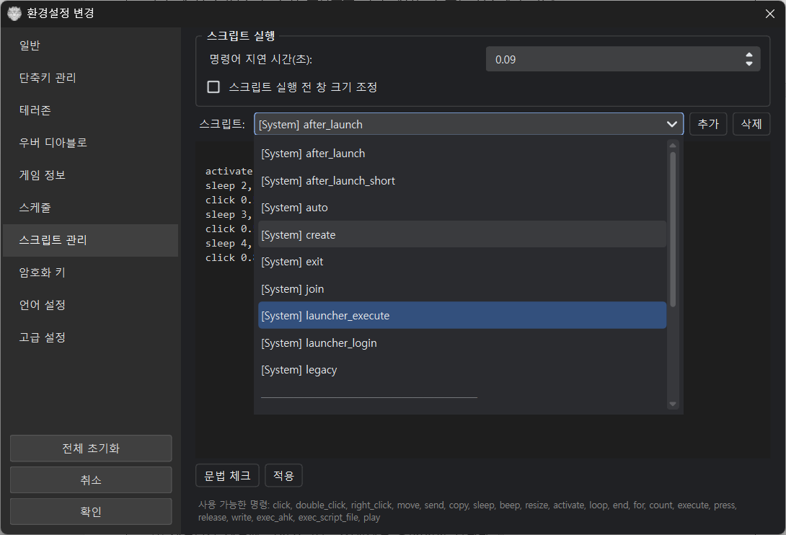
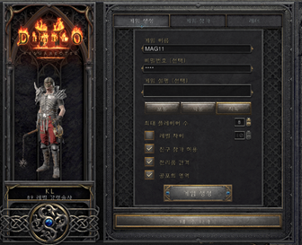
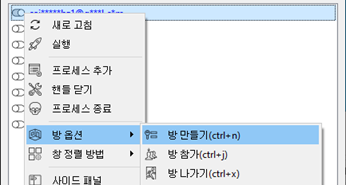

# 스크립트

이 프로그램에 필요한 최소한의 스크립트 기능을 구현하여 사용합니다. 멀티 로더에서 반복작업을 자동화하기 위해서 **자체 구현**한 스크립트 기능입니다. 명령어 처리기에서는 아래의 스크립트 명령어들만 처리할 수 있으며 문법을 정확하게 지켜야 동작합니다. 명령어 간에는 콤마(,)로 파라미터 간에는 공백문자(스페이스)로 구분합니다.

## 마우스 명령어

### click

마우스 왼쪽 버튼을 클릭합니다. 좌표가 지정되면 해당 좌표로 이동 후 클릭합니다. 좌표 값이 1 이하이면 창 크기 대비 비율로 계산합니다.

**형식:** `click` 또는 `click [가로좌표] [세로좌표]`

**예제:**
```
    click 100 50           # 윈도우 창 좌표로 (100, 50) 위치를 클릭
    click 0.5 0.5          # 창의 가운데 위치를 클릭 (비율 좌표)
```

### double_click

마우스 왼쪽 버튼을 더블클릭합니다.

**형식:** `double_click` 또는 `double_click [가로좌표] [세로좌표]`

### right_click

마우스 오른쪽 버튼을 클릭합니다.

**형식:** `right_click` 또는 `right_click [가로좌표] [세로좌표]`

### move

마우스 커서를 주어진 좌표로 이동합니다. click과 마찬가지로 1 이하면 비율로 계산합니다.

**형식:** `move [가로좌표] [세로좌표]`

## 키보드 명령어

### send

주어진 키의 키보드 입력을 만듭니다. 특수키와 조합할 때는 `+`로 연결합니다 (`+` 자체는 `plus` 사용).

사용 가능한 특수키: `alt`, `alt gr`, `ctrl`, `left alt`, `left ctrl`, `left shift`, `left windows`, `right alt`, `right ctrl`, `right shift`, `right windows`, `shift`, `windows`

**형식:** `send [키]`

**예제:**
```
    send ctrl+v             # 조합키: 컨트롤 키를 누른 채로 v를 입력
    send abcd               # abcd 키보드 입력을 만들어서 보냄
```

### press

주어진 키를 누른 상태로 유지합니다. `release`로 해제할 때까지 눌려진 상태가 유지됩니다. `send`는 `press` + `release`의 조합입니다.

**형식:** `press [키]`

### release

눌려진 키를 해제합니다.

**형식:** `release [키]`

**예제:**
```
    press ctrl,
    click 0.5 0.5,          # 컨트롤 키가 눌려진 상태에서 중앙을 클릭
    release ctrl
```

### write

주어진 문자열의 키보드 입력을 만듭니다.

**형식:** `write [문자열]`

**예제:**
```
    write abcdefg            # abcdefg 문자열을 입력 (공백 미포함)
```

## 유틸리티 명령어

### copy

클립보드에 내용을 저장합니다.

**형식:** `copy [문자열]`

**예제:**
```
    copy abcd           # abcd를 클립보드에 저장
```

### sleep

지정한 시간(초, 실수) 만큼 멈추었다가 진행합니다.

**형식:** `sleep [초]`

**예제:**
```
    sleep 0.3           # 0.3초간 쉼
    sleep 5             # 5초간 쉼
```

### beep

비프음을 냅니다. (1초)

**형식:** `beep`

### play

wav 파일을 재생합니다.

**형식:** `play`

### activate

스크립트가 실행 중인 창을 활성화하고 앞으로 가져옵니다.

**형식:** `activate`

### resize

창의 크기 또는 위치를 변경합니다.

**형식:** `resize [너비] [높이]` 또는 `resize [x좌표] [y좌표] [너비] [높이]`

### count

게임 번호를 증가하거나 감소합니다.

**형식:** `count plus` 또는 `count minus`

### log

스크립트 디버깅용 로그를 출력합니다. 프로그램 로그에 `[SCRIPT]` 접두사로 기록됩니다.

**형식:** `log [메시지]`

**예제:**
```
    set x 100,
    log x의 값은 {x} 입니다,       # 로그: [SCRIPT] x의 값은 100 입니다
    log 스크립트 시작
```

## 반복 명령어

### loop

주어진 핸들 리스트를 순회하며 `end`까지 반복합니다.

**형식:** `loop [핸들 리스트] ~ end`

| 핸들 리스트 | 설명 |
|-----|-----|
| {all_games} | 모든 게임 목록, {master_game}: 스크립트를 실행한 게임 |
| {slave_games} | {all_games}에서 {master_game}이 빠진 목록 |
| {slave0} ~ {slave9} | 활성화된 게임에 대응 (계정 목록 순) |

**예제:**
```
    loop {all_games},
        beep,
    end
```

### for

조건 없이 주어진 구간을 반복합니다. 카운터 변수명을 지정하면 반복 인덱스를 `{변수명}`으로 사용할 수 있습니다.

**형식:** `for [시작] [끝] ~ end` 또는 `for [변수명] [시작] [끝] ~ end`

**예제:**
```
    for 0 9,            # 0 ~ 9 까지 반복
        beep,
    end,
    for i 0 5,          # i = 0, 1, 2, 3, 4 — 카운터 변수 사용
        log 현재 {i},
    end
```

### while

조건이 참인 동안 반복합니다. 조건은 매 반복마다 다시 평가됩니다. 무한 루프 방지를 위해 최대 10,000회까지 반복합니다.

**형식:** `while [조건] ~ end`

**예제:**
```
    set sum 0,
    set i 1,
    while {i} <= 100,
        set sum = {sum} + {i},
        set i = {i} + 1,
    end
```

while과 break를 조합하여 특정 조건에서 루프를 중단하는 예제:
```
    set sum 0,
    set i 1,
    while {i} <= 100,
        set sum = {sum} + {i},
        if {sum} > 1000,            # 합이 1000 초과 시 중단
            break,
        end,
        set i = {i} + 1,
    end,
    beep
```

### break

현재 실행 중인 루프(loop, for, while)를 즉시 빠져나옵니다.

**형식:** `break`

**예제:**
```
    for i 0 100,
        if {i} > 10,
            break,                  # i가 10을 넘으면 루프 종료
        end,
    end
```

### exit

스크립트 실행을 즉시 종료합니다. 루프나 조건문 내부 어디에서든 사용할 수 있습니다.

**형식:** `exit`

**예제:**
```
    if {score} < 50,
        log 매칭 실패, 스크립트 종료,
        exit,
    end
```

### return

스크립트 실행을 종료하면서 반환값을 글로벌 변수 `{_return}`에 저장합니다. `exec_script_file`로 호출한 서브 스크립트에서 결과를 돌려줄 때 유용합니다. 값 없이 사용하면 `exit`와 동일하게 동작합니다.

**형식:** `return [값]`

**예제:**
```
    getpixelavg 0.5 0.5 5 r g b,
    if {r} > 100,
        return alive,
    else,
        return dead,
    end
```

호출 측에서 반환값 사용:
```
    exec_script_file scripts\check_status.script,
    if '{_return}' == 'dead',
        log 사망 감지!,
        beep,
    end
```

## 조건 명령어

### if

조건으로 분기합니다. 조건은 python 문법을 사용합니다. 중첩 가능합니다.

**형식:** `if [조건] ~ else ~ end`

**예제:**
```
    loop {all_games},
        execute exit,
    end,
    loop {master_game},
        execute create,
    end,
    if ‘{slave_games}’ != ‘’,		# 보조 게임이 있는 경우에만
        loop {slave_games},
            execute join,
        end,
    end,
    sleep 4.5,
    activate {master_game},
    beep
```

중첩 예제:
```
    set slave_count = len(‘{slave_games}’.split()),
    if {slave_count} > 0,
        loop {slave_games},
            execute join,
        end,
        if {slave_count} >= 3,          # 보조 3개 이상이면 오래 대기
            sleep 8,
        else,
            sleep 4.5,
        end,
    end
```

## 변수 명령어

### set

스크립트 실행 중 사용할 **로컬 변수**를 설정합니다. 스크립트가 끝나면 초기화됩니다. 설정된 변수는 `{변수명}` 형태로 사용할 수 있습니다.

**형식:** `set [변수명] [값]` 또는 `set [변수명] = [표현식]`

- `set 변수명 값` — 문자열 값을 그대로 할당
- `set 변수명 = 표현식` — 산술/비교 표현식을 계산한 결과를 할당

**예제:**
```
    set sum 0,                      # sum 변수에 0 할당
    set name hello,                 # name 변수에 "hello" 할당
    set sum = {sum} + 10,           # sum = 0 + 10 → "10"
    set result = max(100, 200),     # result = "200"
```

1 ~ 100까지 합산하는 예제:
```
    activate,
    set sum 0,
    for i 1 101,                    # i = 1, 2, ..., 100
        set sum = {sum} + {i},
    end,
    beep
```

> **참고**: `{game_name}`, `{master_game}`, `{slave0}` 등 시스템 예약 변수는 set으로 덮어쓸 수 없습니다.

### gset

**글로벌 변수**를 설정합니다. 프로그램이 실행되는 동안 유지되며 다른 스크립트에서도 공유됩니다.

**형식:** `gset [변수명] [값]` 또는 `gset [변수명] = [표현식]` 또는 `gset [변수명] ?= [값]`

- `gset 변수명 값` — 문자열 값 할당
- `gset 변수명 = 표현식` — 표현식 계산 결과 할당
- `gset 변수명 ?= 값` — 변수가 **미정의일 때만** 할당 (초기화용)

**예제:**
```
    gset run_count ?= 0,                    # 미정의일 때만 0으로 초기화
    gset run_count = {run_count} + 1,       # 실행할 때마다 +1
    beep
```

홀짝 교대 실행 예제 (auto 스크립트에서 매번 다른 동작):
```
    gset toggle ?= 0,
    gset toggle = 1 - {toggle},             # 0↔1 전환
    loop {all_games},
        execute exit,
    end,
    loop {master_game},
        execute create,
    end,
    if ‘{slave_games}’ != ‘’,
        loop {slave_games},
            execute join,
        end,
        sleep 4.5,
        if {toggle} == 1,                   # 홀수 회차: 레거시 모드 전환
            loop {slave_games},
                execute legacy,
            end,
        end,
    end,
    activate {master_game},
    beep
```

현재 핸들 값을 전역변수로 저장하는 예제:
```
    gset master {master_game},
    gset s0 {slave0},
    gset s1 {slave1},
    gset s2 {slave2},
    gset s3 {slave3},
    beep
```

> **참고**: 변수 우선순위는 시스템 예약 변수 > 로컬 변수(set) > 글로벌 변수(gset) 순서입니다.

## 실행 명령어

### execute

다른 스크립트를 실행합니다. 지정한 스크립트는 사전에 **스크립트 관리**에서 생성해야 합니다.

**형식:** `execute [스크립트명]`

**예제:**
```
    execute my_script   # my_script 스크립트 실행
```

### exec_ahk

AHK 스크립트를 실행합니다. 창 핸들(hwnd)이나 게임명, 패스워드 등을 추가 파라미터로 전달할 수 있습니다.

**형식:** `exec_ahk [스크립트명.ahk] [파라미터...]`

**예제:**
```
    exec_ahk sample.ahk {all_games}
```

sample.ahk — 전달받은 창 핸들로 최대화하고 메시지를 출력하는 AHK 스크립트:
```
    for n, param in A_Args  ; For each parameter:
    {
        WinMaximize, ahk_id %param%
        WinActivate, ahk_id %param%
        MsgBox Parameter number %n% is %param% is maxmized and activated.
    }
```

### exec_script_file

확장자 `.script`인 스크립트 파일을 실행합니다.

**형식:** `exec_script_file [파일명]`

**예제:**
```
    exec_script_file scripts\create.script      # Scripts 폴더에 있는 create.script 실행
```

## 화면 인식 명령어

### getpixel

지정한 좌표의 픽셀 RGB 값을 변수에 저장합니다. 좌표가 1 이하이면 비율 좌표로 처리합니다.

**형식:** `getpixel [x] [y] [r변수] [g변수] [b변수]`

**예제:**
```
    getpixel 0.5 0.5 r g b,        # 화면 중앙의 픽셀 색상을 r, g, b 변수에 저장
    log R={r} G={g} B={b}
```

### getpixelavg

지정한 좌표 주변 영역의 평균 RGB 값을 변수에 저장합니다. 반지름(픽셀)만큼의 영역을 샘플링합니다.

**형식:** `getpixelavg [x] [y] [반지름] [r변수] [g변수] [b변수]`

**예제:**
```
    getpixelavg 0.242 0.897 5 r g b,   # (0.242, 0.897) 좌표 주변 5px 영역의 평균 색상
    log R={r} G={g} B={b}
```

### debugcapture

현재 게임 화면을 DXGI 캡처하여 이미지로 저장합니다. getpixel/getpixelavg 좌표를 확인할 때 유용합니다.

**형식:** `debugcapture [옵션] [x1] [y1] [x2] [y2] ...`

**옵션:**

- `crop=x,y,w,h` — 지정한 영역만 부분 캡처 (비율 좌표 가능)
- `file=파일명` — 저장할 파일명 지정 (기본: `debug_capture.png`)
- 좌표쌍 — 해당 위치에 노란색 마커를 표시

**예제:**
```
    debugcapture,                                           # 전체 화면 캡처 (debug_capture.png)
    debugcapture 0.270 0.897 0.729 0.897,                   # 체력/마나 오브 위치에 마커 표시
    debugcapture file=health_orb.png crop=0.2,0.85,0.15,0.1, # 체력 오브 영역만 부분 캡처
    debugcapture file=slots.png 0.591 0.965 0.676 0.965,    # 슬롯 위치에 마커 표시, 파일명 지정
```

### imgcmp

두 이미지 파일을 비교하여 유사도(0~100%)를 변수에 저장합니다. 픽셀 단위로 비교하며, 크기가 다르면 자동으로 리사이즈합니다.

**형식:** `imgcmp [파일1] [파일2] [결과변수]`

**예제:**
```
    debugcapture file=before.png,               # 기준 이미지 저장
    sleep 3,
    debugcapture file=after.png,                # 현재 화면 저장
    imgcmp before.png after.png sim,            # 비교 → sim에 유사도 저장
    if {sim} > 95,                              # 95% 이상이면
        log 화면 변화 없음 (유사도: {sim}%),
    else,
        log 화면이 변경됨 (유사도: {sim}%),
    end
```

### imgfind

현재 게임 화면에서 템플릿 이미지를 찾아 일치도(0~100%)와 중앙 좌표를 변수에 저장합니다. 화면을 1280x720으로 리사이즈한 뒤 FFT 기반 정규화 교차 상관(NCC)으로 매칭하므로, **게임 해상도와 무관하게** 동일한 기준 이미지를 사용할 수 있습니다.

**형식:** `imgfind [템플릿파일] [결과변수] [cx변수 cy변수] [w변수 h변수] [rx변수 ry변수]`

**옵션:**

- `file=파일명` — 현재 화면 대신 저장된 이미지 파일에서 검색

**결과 변수:**

- `결과변수` — 일치도 (0~100)
- `cx변수 cy변수` — 찾은 영역의 **중앙 좌표** (1280x720 기준 픽셀)
- `w변수 h변수` — 템플릿 크기 (1280x720 기준 픽셀)
- `rx변수 ry변수` — 찾은 영역의 **중앙 좌표** (0.0~1.0 비율, click에 바로 사용 가능)

!!! note "기준 이미지 준비"
    기준(템플릿) 이미지는 1280x720 스케일에서 캡처해야 합니다.
    **도구 → Image Capture** 메뉴에서 게임 화면을 캡처하고 영역을 선택하여 저장할 수 있습니다.

**예제:**
```
    # 로비 버튼 아이콘이 화면에 있는지 확인
    imgfind lobby_btn.png score,
    if {score} > 80,
        log 로비 버튼 발견 (일치도: {score}%),
    end

    # 비율 좌표로 바로 클릭 (해상도 무관)
    imgfind lobby_btn.png score cx cy w h rx ry,
    if {score} > 80,
        click {rx} {ry},
    end

    # 픽셀 좌표 사용 (게임이 1280x720일 때)
    imgfind lobby_btn.png score cx cy,
    if {score} > 80,
        click {cx} {cy},
    end

    # 저장된 화면 파일에서 검색
    debugcapture file=screen.png,
    imgfind file=screen.png lobby_btn.png score cx cy,
```

### readtext

화면 영역 또는 이미지 파일에서 텍스트를 인식(OCR)하여 변수에 저장합니다. Windows OCR API를 사용합니다.

**형식:** `readtext [x] [y] [w] [h] [결과변수]` 또는 `readtext file=[파일명] [결과변수]`

**옵션:**

- `lang=언어코드` — OCR 언어 지정 (예: `en`, `ko`, `ja`)
- `file=파일명` — 이미지 파일에서 읽기 (화면 캡처 대신)

**예제:**
```
    readtext 0.3 0.1 0.4 0.05 title,                   # 화면 영역에서 텍스트 읽기
    readtext 0.3 0.1 0.4 0.05 title lang=ko,            # 한국어로 읽기
    readtext file=capture.png result,                    # 파일에서 읽기
    log 인식된 텍스트: {title}
```

**활용 예제 — 화면 상태 감지:**
```
    debugcapture file=screen.png crop=0.4,0.0,0.2,0.05, # 화면 상단 영역 캡처
    readtext file=screen.png status lang=en,             # 텍스트 읽기
    log 현재 상태: {status}
```

!!! note "Windows OCR 언어팩"
    OCR 기능을 사용하려면 Windows에 해당 언어팩이 설치되어 있어야 합니다.
    Windows 설정 → 시간 및 언어 → 언어 및 지역에서 추가할 수 있습니다.

## 스크립트 설정

**환경설정 → 환경설정 변경 → 스크립트 관리**에서 스크립트를 변경하거나 추가, 삭제할 수 있습니다. 내부적으로 사용하는 스크립트는 [System] 으로 시작하고 수정은 가능하지만 삭제할 수 없습니다.



## 스크립트 예제

### 게임 만들기

```
    activate,                                   # 현재 게임 클라이언트 활성화
    count plus,                                 # 게임 번호를 하나 증가
    copy {game_name},                           # 게임 이름을 클립보드에 복사
    click {create_x} {create_y},                # 대기실의 "게임 생성" 탭 좌표 클릭 {create_x} {create_y} 값은 자동 계산 대체됨
    click {create_title_x} {create_title_y},    # 대기실의 "게임 생성" 탭에서 "게임 이름" 입력창 클릭
    send ctrl+a,                                # 이전 게임 이름을 삭제하기 위해 전체 선택(ctrl+a)
    send del,                                   # 이전 게임 이름 삭제
    send ctrl+v,                                # 클립보드에서 게임 이름 붙여넣기
    sleep 0.1,                                  # 0.1초 대기
    copy {game_password},                       # 비밀번호를 클립보드에 복사
    send tab,                                   # 비밀번호 입력창으로 이동
    send ctrl+a,                                # 이전 비밀번호를 삭제하기 위해 전체 선택(ctrl+a)
    send del,                                   # 이전 패스워드 삭제
    send ctrl+v,                                # 클립보드에서 비밀번호 붙여넣기
    send enter,                                 # 게임 생성 (enter를 누르면 게임이 생성됨)
    sleep 0.2                                   # 0.2초 대기
```



1. 게임을 생성할 캐릭터를 대기실에 위치시킵니다.
2. 난이도 선택, 레벨 차이, 친구참가 허용 등 기본적인 설정을 합니다.
3. 단축키가 설정되어 있으면 `ctrl+n`, 해당 계정(들)을 선택 후 오른쪽 마우스로 컨텍스트 메뉴를 활성화 한 후에 `게임 옵션`에서 `게임 만들기`를 선택합니다.

    

4. 기능이 정상적으로 동작하면 `환경설정 변경` → `게임 정보`에 입력한 정보로 게임을 만들게 됩니다. 게임 생성시 게임번호(Count)가 하나씩 증가합니다.
5. 여러 계정 목록을 선택 후 "게임 생성"을 하는 경우에는 게임번호가 하나씩 증가하면서 별도 게임을 만들게 됩니다. (우버 디아블로용으로 여러 게임을 만드는 경우에 편리)

!!! tip "방 제목에 암호가 입력되는 등 입력 문제가 발생하는 경우"
    클립보드 방식(`copy` + `send ctrl+v`)에서 문제가 발생하면 `write` 명령어로 변경하세요.
    `write`는 키보드로 직접 타이핑하는 방식이므로 클립보드 충돌 없이 안정적으로 입력됩니다.
    예: `copy {game_name}` + `send ctrl+v` → `write {game_name}`

### 게임 참가

```
    activate,                                       # 현재 게임 클라이언트 활성화
    copy {game_name},                               # 게임 이름을 클립보드에 복사
    click {join_x} {join_y},                        # 대기실의 "게임 참가" 탭 좌표 클릭 {join_x} {join_y} 값은 자동 계산 대체됨
    click {join_title_x} {join_title_y},            # 대기실의 "게임 참가" 탭에서 "게임 이름" 입력창 클릭
    send ctrl+a,                                    # 이전 게임 이름을 삭제하기 위해 전체 선택(ctrl+a)
    send del,                                       # 이전 게임 이름 삭제
    send ctrl+v,                                    # 클립보드에서 게임 이름 붙여넣기
    sleep 0.1,                                      # 0.1초 대기
    copy {game_password},                           # 비밀번호를 클립보드에 복사
    send tab,                                       # 비밀번호 입력창으로 이동
    send ctrl+a,                                    # 이전 비밀번호를 삭제하기 위해 전체 선택(ctrl+a)
    send del,                                       # 이전 패스워드 삭제
    send ctrl+v,                                    # 클립보드에서 비밀번호 붙여넣기
    send enter,                                     # 게임 참가
    sleep 0.2                                       # 0.2초 대기
```

1. 참가할 게임이 게임 정보로 미리 만들어져 있어야 합니다.
2. 위에서 게임을 생성한 캐릭터와 다른 캐릭터를 대기실에 위치시킵니다.
3. 단축키가 설정되어 있으면 `ctrl+j`, 해당 계정(들)을 선택 후 오른쪽 마우스로 컨텍스트 메뉴를 활성화 한 후에 `게임 옵션`에서 `게임 참가`를 선택합니다.
4. 기능이 정상적으로 동작하면 `환경설정 변경` → `게임 정보`에 입력한 정보로 입장하게 됩니다. 

※ 여러 계정 목록을 선택 후 "게임 참가"하는 경우 현재 "게임 정보"의 게임 하나에 모두 입장하게 됩니다. 

### 게임 나가기

```
    activate,                               # 현재 게임 클라이언트 활성화
    send space,                             # 캐릭터 상태나 인벤토리 창을 닫음
    send esc,                               # 게임 메뉴 팝업
    sleep 0.1,                              # 0.1초 대기
    click 0.5 0.436,                        # 나가기 버튼 클릭 (비율 좌표)
    sleep 0.2                               # 0.2초 대기
```

1. 캐릭터가 게임에 들어와 있는 상태(게임 중)이어야 합니다.
2. 단축키가 설정되어 있으면 "ctrl+x", 적용할 계정(들)을 선택 후 오른쪽 마우스로 컨텍스트 메뉴를 활성화 한 후에 `게임 옵션`에서 `게임 나가기`를 선택합니다.
3. 기능이 정상적으로 동작하면 캐릭터는 대기실 화면에 있게 됩니다.

- 게임 중에 "게임 나가기"를 두 번 실행하면 캐릭터 선택 화면으로 나가게 됩니다.

### 레거시 모드로 전환

1. 캐릭터가 게임에 들어와 있는 상태(게임 중)이어야 합니다.
2. 단축키가 설정되어 있으면 `ctrl+l`, 계정(들)을 선택 후 오른쪽 마우스로 컨텍스트 메뉴를 활성화 한 후에 `게임 옵션`에서 `레거시 모드로 전환`을 선택합니다.

- **악마술사의 군림에서는 레거시 모드가 지원되지 않습니다.**

### 자동(auto) 스크립트

```
    loop {all_games},           # 모든 게임에 대해서 순회
        execute exit,           # 게임 나가기 스크립트 실행
    end,
    loop {master_game},         # 주 게임에 대해서 순회
        execute create,         # 게임 생성 스크립트 실행
    end,
    loop {slave_games},         # 보조 게임들만 순회
        execute join,           # 게임 참가 스크립트 실행
    end,
    sleep 4.5,                  # 참가완료까지 4.5초 대기
    loop {slave_games},         # 보조 게임들만 순회
        execute legacy,         # 레거시 모드로 전환
    end,
    activate {master_game},     # 주 게임 활성화
    beep
```

위 스크립트는 여러 작업을 자동화 한 것입니다. 하나씩 따라해 봐야 이해가 쉽습니다.

1. 메인 캐릭터와 서브 캐릭터가 모두 게임에 들어와 있는 상태(게임 중) 이어야 합니다.
2. 단축키가 설정되어 있으면 `ctrl+a`, 또는 `게임 옵션`에서 `자동`을 선택합니다.
3. 기능이 정상적으로 동작하면 모든 캐릭터는 새로 만들어진 게임에 들어와 있어야 합니다.

- 단축키로 실행 시 **활성화된 게임에 계정이 이 메인 캐릭터**로 게임을 만들게 됩니다. 컨텍스트 메뉴에서 실행 시에는 **클릭한 계정이 메인 캐릭터**가 됩니다. 게임 나가기, 게임 만들기, 게임 참가, 레거시 모드로 전환을 반복합니다.

### 자동(auto) 스크립트 — 부캐 전용 모드

주 게임이 이미 만들어져 있는 상태에서, 게임을 새로 생성하지 않고 **모든 클라이언트가 참가만** 수행하는 스크립트입니다.

```
    loop {all_games},           # 모든 게임에 대해서 순회
        execute exit,           # 게임 나가기 스크립트 실행
    end,
    count plus,                 # 게임 번호 증가 (create 없이 번호만 맞춤)
    loop {all_games},           # 모든 게임에 대해서 순회 (전원 참가)
        execute join,           # 게임 참가 스크립트 실행
    end,
    sleep 4.5,                  # 참가완료까지 4.5초 대기
    activate {master_game},     # 주 게임 활성화
    beep
```

- 다른 계정이 이미 게임을 만든 상태에서 사용합니다.
- `count plus`로 게임 번호만 증가시킨 후 전원 `join`을 실행합니다.

### 게임 나가기 (키보드 방식)

마우스 클릭 대신 키보드 방향키로 나가기를 수행하는 스크립트입니다. 마우스 좌표 문제가 있을 때 대안으로 사용할 수 있습니다.

```
    activate,                   # 현재 게임 클라이언트 활성화
    send space,                 # 캐릭터 상태나 인벤토리 창을 닫음
    send esc,                   # 게임 메뉴 팝업
    send up,                    # 나가기 버튼 위치로 이동
    send up,
    send up,
    send down,
    send enter                  # 나가기 버튼 선택
```

### 체력/마나 자동 물약 (check_status)

체력/마나 오브의 색상을 감시하여 부족할 때 자동으로 물약을 사용하는 스크립트입니다.
**스케줄 대시보드**에 등록하여 주기적으로(1~3초 간격) 실행합니다.

```
    activate,                                       # 현재 게임 클라이언트 활성화
    getpixelavg 0.270 0.897 5 r g b,                # 체력 오브 중심 5px 평균 색상 → r, g, b
    if {r} < 100,                                    # 체력 오브 R값이 100 미만이면 (체력 부족)
        send 1,                                      # 물약 슬롯 1번 사용 (체력 포션)
    end,
    getpixelavg 0.729 0.897 5 r g b,                # 마나 오브 중심 5px 평균 색상 → r, g, b
    if {b} < 100,                                    # 마나 오브 B값이 100 미만이면 (마나 부족)
        send 3,                                      # 물약 슬롯 3번 사용 (마나 포션)
    end
```

**동작 원리:**

- DXGI 캡처로 오브 유리 중심 픽셀의 평균 색상을 읽어 체력/마나 잔량을 판단합니다.
- 체력 오브 좌표: `(0.270, 0.897)`, 마나 오브 좌표: `(0.729, 0.897)` (비율 좌표)
- 정상 수치: 체력 R≈117+, 마나 B≈112+ / 위험: R<100 또는 B<100
- 물약 슬롯 배치: **1번=체력, 3번=마나**

### 체력/마나 자동 물약 — 빈 슬롯 감지 (check_status2)

check_status의 개선판으로, **물약 슬롯이 비어있으면 다음 슬롯의 물약을 자동으로 사용**합니다. 또한 순정 또는 모드에 따라 슬롯 좌표를 자동 분기합니다.

```
    activate,                                        # 현재 게임 클라이언트 활성화
    if "{mod}" == "mymod",                           # mymod 모드명인 경우
        gset slot1_x = 0.344,                        # 슬롯1 X 좌표 (체력 포션 1번)
        gset slot2_x = 0.377,                        # 슬롯2 X 좌표 (체력 포션 2번)
        gset slot3_x = 0.414,                        # 슬롯3 X 좌표 (마나 포션 1번)
        gset slot4_x = 0.445,                        # 슬롯4 X 좌표 (마나 포션 2번)
        gset slot_y = 0.958,                         # 슬롯 공통 Y 좌표
    else,                                            # 바닐라 모드인 경우
        gset slot1_x = 0.591,                        # 슬롯1 X 좌표
        gset slot2_x = 0.613,                        # 슬롯2 X 좌표
        gset slot3_x = 0.645,                        # 슬롯3 X 좌표
        gset slot4_x = 0.676,                        # 슬롯4 X 좌표
        gset slot_y = 0.965,                         # 슬롯 공통 Y 좌표
    end,
    getpixelavg 0.270 0.897 5 r g b,                # 체력 오브 중심 5px 평균 색상 → r, g, b
    if {r} < 100,                                    # 체력 부족 감지 (R < 100)
        getpixel {slot1_x} {slot_y} sr sg sb,        #   슬롯1 픽셀 색상 확인
        if {sr} + {sg} + {sb} > 120,                 #   슬롯1에 포션이 있으면
            send 1,                                  #     슬롯1 사용 (체력 포션)
        else,                                        #   슬롯1이 비어있으면
            send 2,                                  #     슬롯2 사용 (예비 체력 포션)
        end,
    end,
    getpixelavg 0.729 0.897 5 r g b,                # 마나 오브 중심 5px 평균 색상 → r, g, b
    if {b} < 100,                                    # 마나 부족 감지 (B < 100)
        getpixel {slot3_x} {slot_y} sr sg sb,        #   슬롯3 픽셀 색상 확인
        if {sr} + {sg} + {sb} > 120,                 #   슬롯3에 포션이 있으면
            send 3,                                  #     슬롯3 사용 (마나 포션)
        else,                                        #   슬롯3이 비어있으면
            send 4,                                  #     슬롯4 사용 (예비 마나 포션)
        end,
    end
```

**check_status와의 차이점:**

| 기능 | check_status | check_status2 |
|------|-------------|---------------|
| 체력 부족 시 | 슬롯 1번 사용 | 슬롯 1번 사용, 비어있으면 **슬롯 2번** 자동 전환 |
| 마나 부족 시 | 슬롯 3번 사용 | 슬롯 3번 사용, 비어있으면 **슬롯 4번** 자동 전환 |
| 모드 지원 | 바닐라 전용 | 바닐라 / mymod **자동 분기** |
| 빈 슬롯 감지 | 미지원 | 슬롯 픽셀 색상으로 판별 |

**빈 슬롯 판정 기준:**

- 비어있을 때 RGB: ~26-37 (합계 78-111, 어두운 색)
- 포션이 있을 때 RGB: 155+ (합계 500+, 밝은 색)
- 판정 기준: RGB 합계 > 120 → 포션 있음

**권장 슬롯 배치:**

| 슬롯 | 용도 |
|------|------|
| 1번 | 체력 포션 (메인) |
| 2번 | 체력 포션 (예비) |
| 3번 | 마나 포션 (메인) |
| 4번 | 마나 포션 (예비) |

**사용 방법:**

1. 환경설정 → 스케줄 탭에서 check_status 또는 check_status2 스크립트를 선택합니다.
2. 실행 주기를 설정합니다 (1~3초 간격 권장).
3. 모드(바닐라/mymod)는 계정 설정의 mod 값에 따라 자동 판별되므로 별도 설정이 필요 없습니다.

!!! warning "주의사항"
    - 화면이 가려지거나 인벤토리가 열려 있으면 오브/슬롯 색상 인식이 정확하지 않을 수 있습니다.
    - 순정(바닐라) 외 다른 모드를 사용하는 경우, 슬롯 좌표가 다를 수 있어 스크립트를 커스텀 수정해야 합니다.

### 버프 스킬 자동 사용 (custom1)

보조 무기로 전환 후 함성/버프 스킬을 사용하고 주 무기로 복귀하는 스크립트입니다.
스킬 단축키(F8~F11)는 게임 내 설정에 맞게 수정해서 사용합니다.

```
    activate,       # 현재 게임 클라이언트 활성화
    send w,         # 보조 무기 전환 (소집)
    sleep 0.3,
    send f9,        # 전투명령 (f9 할당)
    sleep 0.1,
    send f9,
    sleep 0.1,
    send f10,       # 전투지시 (f10 할당)
    sleep 0.1,
    send f10,
    sleep 0.1,
    send f11,       # 전투의 함성 (f11 할당)
    sleep 0.1,
    send f11,
    sleep 0.1,
    send f8,        # 에너지 쉴드 (f8 할당)
    sleep 0.5,
    send w          # 주 무기 전환
```

### 도박용 거래 (custom2)

상점에서 물건을 구매하고 인벤토리에서 바로 판매하는 것을 반복하는 도박용 스크립트입니다.
좌표는 게임 해상도와 상점 위치에 따라 수정이 필요합니다.

```
    activate,                       # 현재 창 활성화
    for 1 100,                      # 100회 반복
        right_click 844 398,        # 상점 물건 클릭 (좌표 수정 필요)
        sleep 0.1,
        press ctrl,                 # 컨트롤키를 누르고 있음
        click 2333 976,             # 인벤토리 물건 클릭 (좌표 수정 필요)
        release ctrl,               # 컨트롤키를 뗌
        sleep 0.1,
    end
```

### 이미지 찾아서 서브 클라이언트 클릭 (custom3)

메인 게임 화면에서 특정 이미지(캐릭터 등)를 찾고, 서브 게임 클라이언트들을 순회하며 해당 좌표를 클릭한 뒤 메인 게임으로 포커스를 되돌리는 스크립트입니다.

```
    loop {slave_games},                                 # 서브 게임들 순회
        activate,                                       # 서브 게임 활성화
        sleep 0.2,                                      # 화면 전환 대기
        imgfind target.png score cx cy w h rx ry,       # 현재 서브 화면에서 이미지 검색
        if {score} > 80,                                # 일치도 80% 이상이면
            click {rx} {ry},                            # 비율 좌표로 클릭 (해상도 무관)
            log 클릭 완료 (일치도: {score}%, 좌표: {rx} {ry}),
        else,
            log 이미지를 찾지 못함 (일치도: {score}%),
        end,
        sleep 0.1,
    end,
    activate {master_game},                             # 메인 게임으로 포커스 복귀
    beep
```

- `target.png`는 **도구 → Image Capture**에서 1280x720 기준으로 캡처한 기준 이미지입니다.
- 각 서브 클라이언트 화면에서 개별로 이미지를 검색하므로 클라이언트마다 위치가 달라도 정확히 클릭합니다.
- 비율 좌표(`rx`, `ry`)를 사용하므로 해상도가 달라도 동작합니다.
- 일치도 기준값(80)은 상황에 따라 조정합니다.