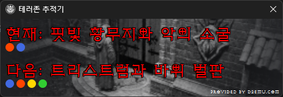
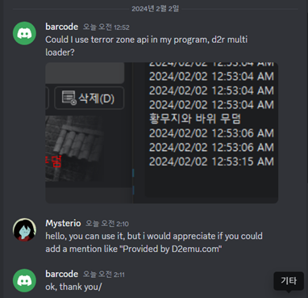
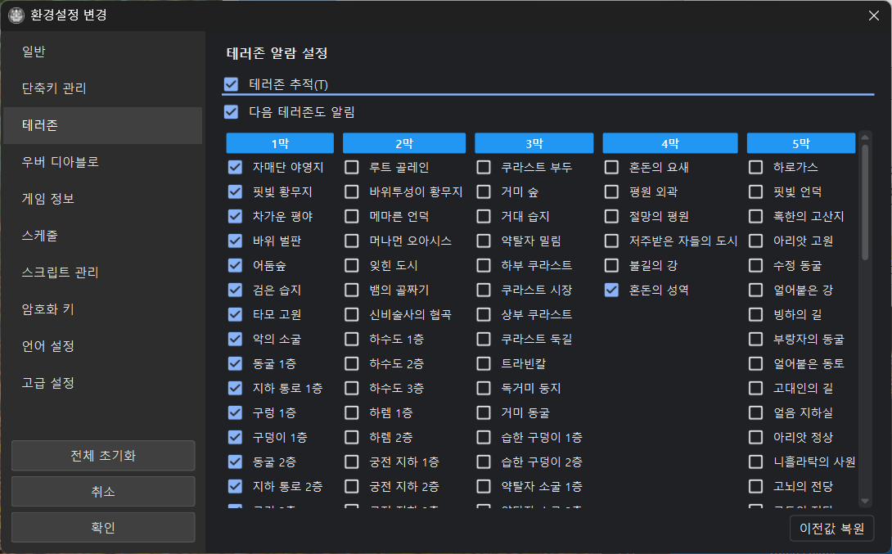

# 테러존 트래커

현재 및 다음 공포의 영역과 해당 지역 몹들의 면역속성 정보를 표시합니다.

활성화 시 위 그림과 같이 사이드 패널 이미지 위에 현재 테러존 지역과 다음 테러존 지역이 표시됩니다. 이 기능은 http://d2emu.com 에서 제공하는 Terror zone tracker API를 사용해서 구현되었습니다. API 제작자에게는 사용에 대한 허락을 받았으며 제작자 요구에 따라 이미지 하단에 "provided by d2emu.com" 문구를 삽입하였습니다. ‘24년 8월29일 이후 d2remu.com에서 제공하던 테러존 API가 토큰 인증 방식으로 바뀌었습니다. V3.2 버전 이상에서만 정상적으로 동작합니다.

## 표시 정보

|항목|설명|
|------|------|
|현재 공포의 영역|현재 활성화된 공포의 영역을 보여줍니다.|
|다음 공포의 영역|다음에 활성화될 공포의 영역을 보여줍니다.|
|면역속성|테러존 지역에 몹들의 면역속성 정보를 보여줍니다.|

## 데이터 출처

이 기능은 [d2emu.com](http://d2emu.com)에서 제공하는 Terror Zone Tracker API를 사용합니다.

!!! note "API 인증"
    2024년 8월 29일 이후 토큰 인증 방식으로 변경되었습니다.
    **v3.2 버전 이상**에서만 정상 동작합니다.

## 음성 안내

    테러존 변경 시 음성으로 알려줍니다. (edge-tts 사용)

### 소리 설정

**환경설정 → 환경설정 변경 → 일반 → 알람설정 → 소리 활성화**에서 켜고 끌 수 있습니다.

## 활성화

**환경설정 → 환경설정 변경 → 테러존 → 테러존 추적** 체크

활성화하면 사이드 패널 이미지 위에 테러존 정보가 표시됩니다.
