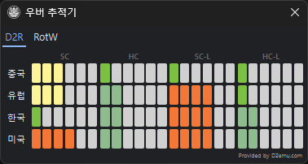

# 우버 트래커

   우버 디아블로(DClone) 상태를 지역/모드별로 추적합니다.

   

## 실행 방법

   메인메뉴에서 **도구 → 우버 추적기**로 실행합니다.

## 표시 정보

다음 조합별로 우버 디아블로 상태를 표시합니다:

- **게임버전**: 확장판, 악마술사의 군림(RotW)
- **지역**: Americas, Europe, Korea, China
- **모드**: 소프트코어(SC), 하드코어(HC)
- **타입**: 래더(Ladder), 비래더(Non-Ladder)

## 상태 단계

   |단계|한글 메시지|영문 메시지|
   |------|------|------|
   |1단계|성역에 공포의 응시가 느껴집니다.|Terror gazes upon Sanctuary.|
   |2단계|성역에 공포가 다가 옵니다.|Terror approaches Sanctuary|
   |3단계|성역 안에 공포가 형성되기 시작합니다.|Terror begins to from within Sanctuary.|
   |4단계|성역 곳곳에 공포가 퍼집니다.|Terror spreads across Sanctuary.|
   |5단계|성역에 공포가 풀려나려 합니다.|Terror is about to be unleashed upon Sanctuary.|
   |6단계|**디아블로가 성역을 침공했습니다.**|**Diablo has invade Sanctuary.**|

## 데이터 출처

   [d2emu.com](https://d2emu.com)에서 제공하는 API를 사용합니다.

!!! note "API 인증"
    2024년 8월 29일 이후 API 접근에 인증이 필요합니다.
    **v3.2 버전 이상**에서 지원합니다.