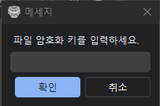
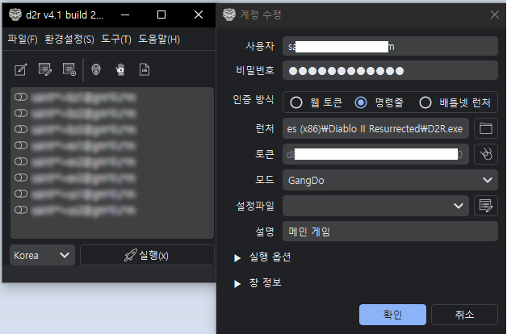
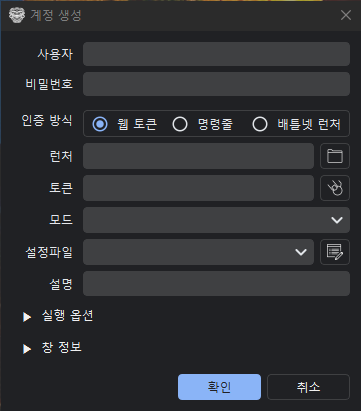

# 첫 실행

## 암호화 키 설정

처음 실행 시 **파일 암호화 키**를 설정해야 합니다.

이 키는 계정 정보 파일(`default.dat`)을 암호화하는데 사용됩니다.

!!! tip "암호화 키 권장사항"
    - 8자리 이상
    - 특수문자 포함
    - 숫자 포함
    - 다른 사람이 유추하기 어렵게

암호화 키는 나중에 **환경설정 → 암호화 키**에서 변경할 수 있습니다.

## 메인 화면 구성

| 영역 | 설명 |
|------|------|
| 메뉴바 | 파일, 환경설정, 게임 옵션, 도구 등 |
| 사이드 패널 | 계정 정보 입력/수정/삭제 |
| 계정 목록 | 등록된 계정 목록 표시 |
| 하단 패널 | 실행 옵션 및 실행 버튼 |

## 계정 등록

### 필수 항목

1. **사용자**: 배틀넷 계정 이메일
2. **비밀번호**: 배틀넷 계정 비밀번호
3. **인증방식**: 명령줄 / 웹 토큰 / 배틀넷 런처
4. **런처**: `d2r.exe` 또는 `Diablo II Resurrected Launcher.exe` 경로

### 선택 항목

- **모드**: 사용할 모드명 (없으면 비워둠)
- **설정파일**: 클라이언트별 설정 파일 (Settings.json)
- **설명**: 창 제목에 표시할 설명

### 계정 추가 절차

1. 사이드 패널에서 **사용자**, **비밀번호** 입력
2. **인증방식** 선택
3. **런처** 경로 지정
4. **생성** 버튼 클릭
5. 계정 목록에 추가됨

!!! warning "아시아 서버 접속"
    아시아(한국) 서버의 경우 **명령줄 방식**이 차단되어 있습니다.

    **웹 토큰** 방식을 사용하거나, 토큰을 발급받아 저장해야 합니다.

## 파일 저장

계정 정보를 저장하지 않으면 프로그램 종료 시 사라집니다.

**파일 → 저장** 또는 `Ctrl+S`로 저장합니다.

- 기본 저장 위치: 실행 파일과 같은 폴더의 `default.dat`
- 다른 위치에 저장: **파일 → 다른 이름으로 저장**

## 인증 방식 선택

### 명령줄 방식 (권장 - OTP 미사용 시)

- 가장 간단한 방식
- 아이디, 비밀번호로 직접 인증
- **아시아 서버는 차단됨** (미주, 유럽 서버만 가능)

### 웹 토큰 방식 (권장 - OTP 사용 시)

- 토큰을 발급받아 인증
- OTP(인증기) 사용 계정 지원
- 아시아 서버 접속 가능

토큰 발급 방법은 [계정 관리 - 토큰 발급](../features/account-management.md#토큰-발급)을 참고하세요.

### 배틀넷 런처 방식

- 배틀넷 런처를 통해 실행
- 스크립트로 자동 로그인
- 동기화 문제가 발생할 수 있음

## 다음 단계

계정 등록이 완료되었으면 [멀티 런처](../features/multi-launcher.md)를 확인하여 실행 방법을 알아보세요.
