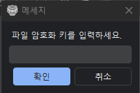
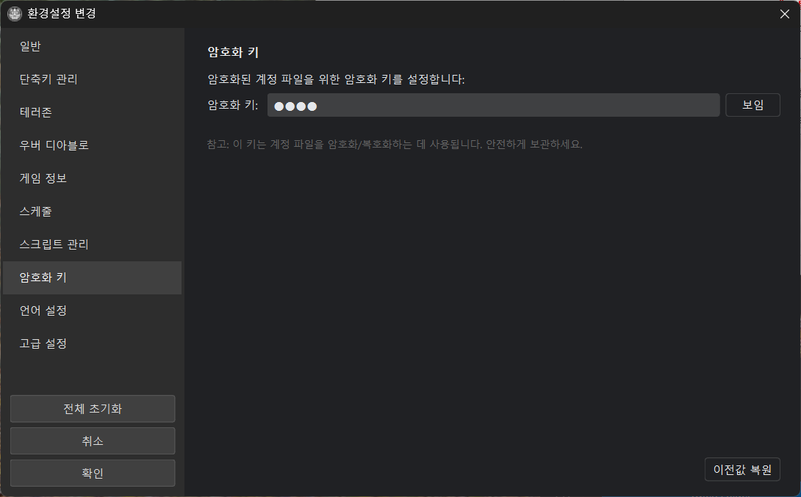
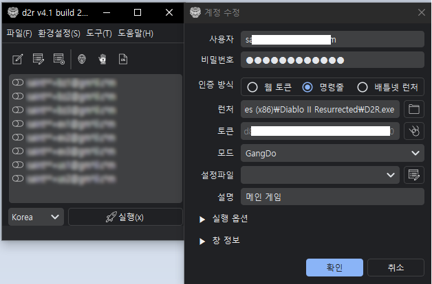

# 첫 실행

## 암호화 키 설정

처음 실행 시 파일 암호화 키를 물어봅니다. 계정정보 파일(default.dat)를 암호화하는데 사용되는 암호화 키입니다. 보안을 위한 최소한의 장치이니 다른 사람들이 유추하기 어렵게 만드세요. 8자리 이상, 특수문자, 숫자 포함해서 만드는 것을 추천합니다.

- 나중에 변경하실 때는 **환경설정 → 환경설정 변경 → 암호화 키**에서 변경할 수 있습니다.

## 메인 화면 구성

|영역|설명|
|----|-----|
|메뉴바|파일, 환경설정, 도구 등 메인 메뉴가 위치합니다.|
|사이드 패널|계정 정보 입력/수정/삭제할 수 있는 사이트 패널 영역입니다.|
|계정 목록|현재 등록된 계정 목록을 표시합니다.|
|하단 패널|하단 더블클릭으로 토글할 수 있으며 서버를 변경해서 실행할 수 있습니다.|

## 계정 등록

|순서|설명|
|:---:|---|
|1|로그인에 필요한 배틀넷 계정 정보(**사용자**와 **비밀번호**)를 입력하고 **인증방식**을 선택합니다.|
|2|**인증 방식**에 따라서 **런처**를 지정해줍니다. 웹 토큰 방식의 경우에는 자동 또는 수동으로 토큰을 발급합니다.|
|3|**확인** 버튼을 클릭하면 오른쪽 계정 목록에 추가됩니다.  위의 작업을 필요한 계정 수만큼 반복합니다.|
|4|**파일** > **저장**으로 파일로 저장해야 프로그램 다시 시작 시 위 작업을 반복하지 않습니다.|

~~아시아 서버의 경우에는 사용자와 비밀번호 외에 추가로 토큰을 발급, 저장 후 사용해야 배틀넷 서버에 접속이 가능합니다. FAQ에 "토큰은 어떻게 만드나요"를 참고하세요.~~

- 모드(mod)와 설정파일, 전리품 필터, 설명 등은 실행을 위해서 필수적인 항목은 아닙니다. 나중에 설정해도 됩니다.
- 사용자 아이디, 비밀번호에 콤마(,) 세미콜론(\;), 등호(=) 공백문자(스페이스, 탭 등) 등이 포함된 경우 명령줄 실행이 되지 않는 경우가 있습니다. 이는 이들 문자가 명령줄(command line)에서 구분자 등으로 사용되기 때문입니다.

### 필수 항목

|항목|설명|
|:---:|---|
|**사용자**|배틀넷 계정으로 사용하는 이메일 주소입니다.스팀이나 구글 계정 등은 지원하지 않습니다.|
|**비밀번호**|배틀넷 계정 비밀번호, 위에서 인력한 배틀넷 계정에 대응되는 비밀번호입니다. |
|**인증방식**|명령줄 / 웹 토큰 / 배틀넷 런처 OTP를 사용하는 계정은 웹 토큰을, 그외에는 명령줄 방식을 택해서 사용하세요. |
|**런처**|`d2r.exe` 또는 `Diablo II Resurrected Launcher.exe` 경로. 프로그램 실행에 사용하는 런처입니다. 웹 토큰, 명령줄 방식은 d2r.exe를 선택합니다. |

### 선택 항목

|항목|설명|
|:---:|---|
|**모드**|사용할 모드명 (없으면 비워둠), 해당 계정에서 사용할 모드명을 선택합니다. 사전에 게임 폴더에 모드를 설치해 둬야 합니다. |
|**설정파일**|클라이언트별 해당 계정에서 사용할 설정파일(Settings.json)입니다. **Settings_메인.json** 처럼 **Settings**로 시작하는 json파일로 미리 생성해 놓으세요.|
|**전리품 필터**|클라이언트별 해당 계정에서 사용할 전리품 필터 파일(lootfilter.json)입니다 **lootfilter_메인.json** 처럼 **lootfilter**로 시작하는 json파일로 미리 생성해 놓으세요.|
|**설명**|창 제목, 계정 목록 등에 표시할 설명입니다.|

!!! warning "파일 저장"
    계정 정보를 저장하지 않으면 프로그램 종료 시 사라집니다.
    **파일 → 저장** 또는 `Ctrl+S`로 저장합니다.
    기본 저장 위치: 실행 파일과 같은 폴더의 `default.dat`
    다른 위치에 저장: **파일 → 다른 이름으로 저장**

!!! info "인증방식 선택"
    **1. 명령줄 방식 (권장 - OTP 미사용 시)**
    - 가장 간단한 방식
    - 아이디, 비밀번호로 직접 인증

    **2. 웹 토큰 방식 (권장 - OTP 사용 시)**
    - 토큰을 사전에 발급, 저장하고 토큰으로 인증
    - OTP(인증기) 사용 계정 지원
    토큰 발급 방법은 [계정 관리 - 토큰 발급](../features/account-management.md#토큰-발급)을 참고하세요.
    
    **3. 배틀넷 런처 방식(권장하지 않음)**
    - 배틀넷 런처를 통해 실행
    - 스크립트로 자동 로그인
    - 동기화 문제가 발생할 수 있음

## 다음 단계

계정 등록이 완료되었으면 [멀티 런처](../features/multi-launcher.md)를 확인하여 실행 방법을 알아보세요.
