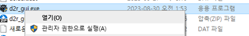
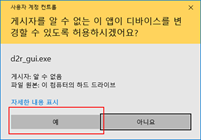

# 설치

## 시스템 요구사항

1. Windows 10 이상 (윈도우 10 23H2 권장)
   특정 버전 윈도우10, 11에서 GPU가속에서 프리징 현상이 발생합니다. 멀티로더 문제는 아니고 윈도우 버전 문제입니다.
2. Diablo II Resurrected 설치와 배틀넷 계정
   여러 게임 클라이언트를 실행하는 경우에는 실행하는 계임 클라이언트 개수 만큼 배틀넷 계정이 필요합니다.
3. 프로그램 실행에 관리자 권한
   실행 중인 프로세스에서 핸들 값을 변경하기 위해서 관리자 권한이 필요합니다.

## 다운로드

### Github 다운로드

[Github 다운로드 링크](https://saintsc-ai.github.io/d2r-manual/dist){ .md-button .md-button--primary}

현재 매뉴얼 사이트 github에서 다운로드합니다.

### Google Drive 드라이브

[Google Drive 드라이브링크](https://drive.google.com/drive/folders/17xfEaOYxdAdqkXL53aY0hIfSbUMHZS4S?usp=share_link){ .md-button .md-button--primary }

구글 드라이브의 경우 압축파일 내 실행 파일의 악성코드 검사를 회피하기 위해서 암호가 걸려있습니다.

!!! warning "압축파일 비밀번호"
    압축 비밀번호: **`0402`**

## 설치 방법

### 압축 해제

다운로드한 파일의 압축을 풉니다.

### 실행 파일 위치

압축을 풀면 다음과 같은 파일들이 있습니다:

| 파일 | 설명 | 최근 빌드 |
|------|------|-----------|
| `d2r_gui.exe` | 메인 멀티 런처 | 2026-03-28 |
| `d2r_uber.exe` | 독립 실행 우버 트래커 | 2026-03-15 |
| `d2r_tz.exe` | 독립 실행 테러존 트래커 | 2026-03-15 |
| `d2r_helper.exe` | D2R 핸들 자동 정리 도구 | 2026-03-15 |

### d2r_gui

`d2r_gui.exe`는 메인 멀티 런처 프로그램입니다. 여러 배틀넷/스팀 계정으로 D2R 클라이언트를 동시에 실행하고 관리할 수 있습니다. 핸들 자동 정리, 스크립트 실행, 테러존/우버 트래커 등 모든 기능이 통합되어 있습니다.

### d2r_uber

`d2r_uber.exe`는 우버 디아블로(DClone) 진행 상황을 추적하는 독립 실행 프로그램입니다. `d2r_gui.exe` 없이 단독으로 사용할 수 있습니다.

### d2r_tz

`d2r_tz.exe`는 공포의 영역(Terror Zone) 정보를 추적하는 독립 실행 프로그램입니다. `d2r_gui.exe` 없이 단독으로 사용할 수 있습니다.

### d2r_helper

`d2r_helper.exe`는 D2R 프로세스의 핸들을 주기적으로 자동 정리하는 독립 실행 프로그램입니다.
멀티 클라이언트 실행 시 핸들 충돌을 방지하기 위해 사용합니다.
설정한 간격(1~10초)마다 자동으로 핸들을 닫으며, 트레이로 최소화하여 백그라운드에서 실행할 수 있습니다.
`d2r_gui.exe`에 핸들 자동 정리 기능이 포함되어 있으므로, 멀티 런처를 사용하는 경우에는 별도로 실행할 필요가 없습니다.

!!! note "백신 예외처리"
    파이썬으로 제작된 프로그램 특성상 일부 백신에서 악성코드로 오탐지할 수 있습니다.
    이는 패키징 프로그램(pyinstaller)으로 만든 실행파일들이 봇이나 악성코드 제작에 많이 사용되어 백신에서 오탐지하는 것입니다.
    **악성코드가 아니니** 백신 프로그램에서 예외 처리 후 사용하세요.

## 관리자 권한 실행

D2R 클라이언트의 핸들을 제어하기 위해 **관리자 권한**으로 실행해야 합니다.

### 방법 1: 오른쪽 클릭 메뉴

1. `d2r_gui.exe` 파일에서 오른쪽 마우스 클릭
2. **관리자 권한으로 실행** 선택

### 방법 2: 더블 클릭

1. `d2r_gui.exe` 더블 클릭
2. 사용자 계정 컨트롤(UAC) 창에서 **예** 선택

## 다음 단계

설치가 완료되었으면 [첫 실행](first-run.md)으로 이동하여 초기 설정을 진행하세요.
