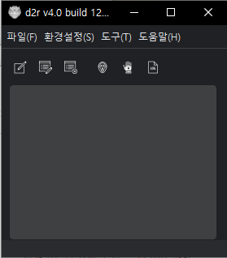

# D2R 다중실행기

!!! warning "경고"

    이 프로그램의 사용으로 발생하는 모든 문제에 대해서 책임은 사용자 본인에게 있습니다.
    

한 컴퓨터에서 여러 **디아블로2 리저렉션** (D2R) 클라이언트를 실행하는 프로그램입니다.

## 주요 기능

- **멀티 클라이언트 실행** - 컴퓨터 사양만 충분하다면 제한 없이 여러 클라이언트 실행
- **다양한 인증 방식** - 명령줄, 웹 토큰, 배틀넷 런처 방식 지원
- **자동화 스크립트** - 게임 생성, 참가, 나가기 등 자동화
- **창 관리** - 레이아웃 저장 및 적용
- **테러존 트래커** - 현재/다음 테러존 지역 표시
- **우버 트래커** - 우버 디아블로 상태 추적

## 빠른 시작

1. [설치](getting-started/installation.md) - 프로그램 다운로드 및 설치
2. [첫 실행](getting-started/first-run.md) - 기본 설정 및 계정 등록
3. [멀티 런처](features/multi-launcher.md) - 여러 클라이언트 실행하기

## 실행 방식

| 방식 | 설명 | OTP 지원 |
|------|------|----------|
| 명령줄 | 기본 실행 방식, 아시아 서버 제한 | X |
| 웹 토큰 | 토큰 발급 후 실행 | O |
| 배틀넷 런처 | 런처를 통한 실행 | O |

!!! tip "추천"
    OTP 사용 시 **웹 토큰** 방식, 그 외에는 **명령줄** 방식을 추천합니다.

## 문의 및 지원

- GitHub: [saintsc-ai/d2r_gui](https://github.com/saintsc-ai/d2r_gui)

---

*프로그램에 사용된 대표 아이콘 이미지는 [문화포털](https://www.culture.go.kr)에서 제공하는 전통문양을 활용하였습니다.*
