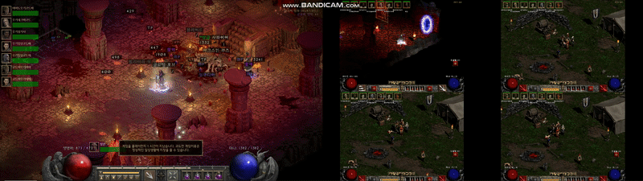
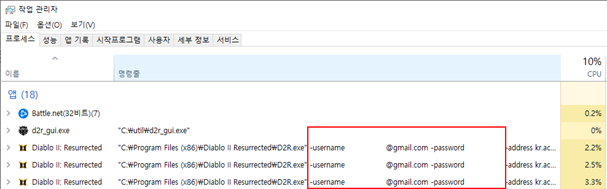

# 디아2 멀티로더

## 프로그램 소개

이 프로그램은 한 컴퓨터에서 여러 "디아블로2 리저렉션" (이하 D2R) 클라이언트를 실행하는 프로그램입니다. 컴퓨터 사양만 충분하다면 실행할 수 있는 클라이언트의 개수는 제한 없습니다.



프로그램에 사용된 대표 아이콘 이미지는 "문화포털"에서 서비스 되는 전통문양을 활용하였습니다. (링크: <https://www.culture.go.kr>) 강릉상석 귀신문 외에 5개 정도의 귀신문이 돌아가면서 적용됩니다. 메뉴 및 UI 아이콘은 오픈소스 아이콘 라이브러리 [Lucide](https://lucide.dev/) (ISC 라이선스)를 사용합니다.


!!! warning "경고"
    **이 프로그램의 사용으로 발생하는 모든 문제에 대해서 책임은 사용자 본인에게 있습니다.**

## 주의사항

### 배틀넷 계정 정지

멀티로더는 외부프로그램으로 사용 시 배틀넷 계정이 정지될 수 있습니다.

*제3자 외부 프로그램은 회사가 배포하는 프로그램 내에 포함되지 않거나, 별도로 이루어진 파일 또는 프로그램이며 이를 통하여 회사가 의도하지 않거나 허용하지 않은 이득을 취하고자 하는 프로그램입니다. 또한, 일반적인 고객들은 얻을 수 없는 게임 및 서비스 정보를 얻거나 파일을 조작 또는 변환 하는 프로그램 역시 포함 됩니다. 이러한 허용되지 않은 제3자 외부 프로그램의 개발, 공유, 배포, 이용할 경우 제재가 진행될 수 있습니다. 허용되지 않는 제3자 외부 프로그램 사용이 확인되면 다음과 같은 제재를 받을 수 있습니다. 1) 계정 정지*

- 참고링크: "배틀넷 운영정책", <https://kr.battle.net/support/ko/article/75793>

### PC방 사용 금지

명령줄 방식으로 실행하면, 서버 접속 시 네트워크 상에 평문으로 계정과 비밀번호가 노출됩니다. 공격자에 의해서 배틀넷 계정정보(사용자 아이디, 비밀번호)를 쉽게 탈취할 수 있습니다. 공격자가 아래 이미지와 같이 작업 관리자에서 계정정보를 쉽게 볼 수 있습니다.



## 구현방법

파이썬(Python)으로 구현되어 있습니다. PySide, win32api, subprocess, Crypto 가 주요 사용된 모듈입니다. UI는 LGPL인 PySide 사용합니다. 프로세스를 찾거나 핸들을 닫거나 하는 프로세스 관련된 처리는 win32api를 사용합니다. 클라이언트 명령줄 실행에는 subprocess 모듈을 사용합니다. 암호화에는 Crypto 모듈을 사용합니다. 스크립트는 keyboard, mouse 모듈을 사용해서 구현했습니다.
개발에 사용된 프로그램 및 모듈의 라이선스와 홈페이지는 아래와 같습니다.

|모듈|라이선스|홈페이지|
|-----|-----|-----|
|Lucide Icons|ISC|<https://lucide.dev/>|
|comtypes|MIT|<https://github.com/enthought/comtypes>|
|debugpy|MIT|<https://github.com/microsoft/debugpy>|
|dxcam|MIT|<https://github.com/ra1nty/DXcam>|
|keyboard|MIT|<https://github.com/boppreh/keyboard>|
|mouse|MIT|<https://github.com/boppreh/mouse>|
|numpy|BSD 3-Clause|<https://numpy.org/>|
|Pillow|HPND|<https://python-pillow.org/>|
|psutil|BSD 3-Clause|<https://github.com/giampaolo/psutil>|
|pycryptodome|BSD / Public Domain|<https://www.pycryptodome.org/>|
|PyInstaller|GPL 2.0 (w/ exception)|<https://pyinstaller.org/>|
|pyperclip|BSD|<https://github.com/asweigart/pyperclip>|
|PySide6|LGPL v3|<https://wiki.qt.io/Qt_for_Python>|
|PyQtDarkTheme-fork|MIT|<https://pyqtdarktheme.readthedocs.io>|
|pywin32|PSF|<https://github.com/mhammond/pywin32>|
|pywinstyles|CC0|<https://github.com/Akascape/py-window-styles>|
|requests|Apache 2.0|<https://github.com/psf/requests>|
|screeninfo|MIT|<https://github.com/rr-/screeninfo/tree/master>|
|selenium|Apache 2.0|<https://www.selenium.dev/>|
|vdf|MIT|<https://github.com/ValvePython/vdf>|
|webdriver-manager|Apache 2.0|<https://github.com/SergeyPirogov/webdriver_manager>|
|winocr|MIT|<https://github.com/GitHub30/winocr>|
|zipencrypt|MIT|<https://github.com/devthat/zipencrypt>|
|vscode|MIT|<https://github.com/microsoft/vscode>|

## 주요 기능

- **멀티 클라이언트 실행** - 컴퓨터 사양만 충분하다면 제한 없이 여러 클라이언트 실행합니다. [링크](features/multi-launcher.md)
- **다양한 인증 방식** - 명령줄, 웹 토큰, 배틀넷 런처 방식 지원합니다. [링크](features/account-management.md)
- **자동화 스크립트** - 게임 생성, 참가, 나가기 등 자동화를 지원합니다. [링크](features/script.md)
- **창 관리** - 게임 클라이언트 창의 레이아웃 저장 및 적용을 지원합니다. [링크](features/layout-manager.md)
- **테러존 트래커** - 현재/다음 테러존 지역 표시합니다. [링크](features/terror-zone.md)
- **우버 트래커** - 우버 디아블로 상태를 추적합니다. [링크](features/uber-tracker.md)

## 빠른 시작

- [설치](getting-started/installation.md) - 프로그램 다운로드 및 설치 방법
- [첫 실행](getting-started/first-run.md) - 기본 설정 및 계정 등록 방법
- [멀티 런처](features/multi-launcher.md) - 여러 클라이언트 실행하는 방법

## 실행 방식

먼저 인증 방식에 대해서 이해가 필요합니다. 명령줄(command line) 방식과 토큰(token) 방식이 있습니다. 명령줄 방식은 "디아블로2 오리지날"부터 제공하던 기능으로 아이디, 비밀번호를 게임 클라이언트(d2r.exe)의 파라미터로 주고 실행하여 인증하는 방식입니다. 실제로 도스창에서 아래 예와 같이 입력해서 실행하면 해당 계정으로 접속됩니다.
```
  d2r.exe -username abc@abc.net -password mypassword
```
참고 링크: <https://d2mods.info/forum/viewtopic.php?t=67329>
토큰 방식은 아이디, 비밀번호를 이용해서 미리 인증을 하고 이때 생성된 토큰으로 로그인 하는 방식입니다. 토큰은 지하철 승차권이나 놀이공원 입장권과 유사하다고 생각하시면 됩니다. 정확하게는OAuth방식이나 이후 편의상 토큰 방식으로 호칭하겠습니다. 배틀넷 런처도 내부적으로는 토큰 방식을 사용합니다.
이 프로그램에서는 아래와 같이 세가지 인증방식을 지원합니다.

|인증방식|내용|비고|
|-----|-----|-----|
|명령줄|아이디, 비밀번호를 파라미터로 주고 명령줄로 실행|인증기 사용 불가|
|웹 토큰|배틀넷 사이트에서 인증, 웹 토큰 생성, 저장 웹 토큰으로 실행|인증기 사용 가능|
|배틀넷 런처|배틀넷 런처를 스크립트로 제어 실행|인증기 사용 가능|

계정 설정에서 인증방식을 지정할 수 있습니다. 모든 인증방식에는 아이디, 비밀번호가 필요합니다. 웹 토큰 방식은 추가로 웹 토큰을 발급받아서 저장해야 합니다. 배틀넷 런처 방식은 배틀넷 런처를 스크립트로 제어하여 실행합니다. ~~블리자드에서 '23년 10월부터 위에 명령줄 방식으로 아시아(한국) 서버 접속하는 것을 차단했습니다.~~ 다시 명령줄 방식을 지원합니다. 이 프로그램에서는 추가로 웹 토큰 방식이나 배틀넷 런처를 통한 실행과 접속을 사용합니다. 인증 방식은 OTP를 사용하는 경우에는 "웹 토큰" 방식을 그 외에는 "명령줄" 방식을 추천합니다. "배틀넷 런처" 방식은 "웹 토큰" 방식이 구현되기 전에 임시적으로 사용한 방식이고 스크립트를 이용해서 **비동기적**으로 실행되기에 문제가 많이 발생합니다.

!!! tip "추천"
    OTP 사용 시 **웹 토큰** 방식, 그 외에는 **명령줄** 방식을 추천합니다.

## 멀티 클라이언트

D2R클라이언트의 중복 실행을 막기 위해서 프로세스에서 특정 핸들을 확인하는데, 멀티 클라이언트 실행하기 위해서 아래의 해당하는 핸들을 닫습니다.
```
  \Sessions\[임의숫자]\BaseNamedObjects\DiabloII Check For Other Instances
```
- 참고 링크: <https://us.forums.blizzard.com/en/d2r/t/how-to-multiple-d2r-instances-requires-two-accounts/60546>

이 프로그램에서는 자체 구현한 함수를 이용해서 해당하는 핸들을 닫습니다. process explorer(이하 PE)로 하는 방법과 같은 방식입니다.

## 문의 및 지원

GitHub: [saintsc-ai/d2r-manual](https://github.com/saintsc-ai/d2r-manual)
